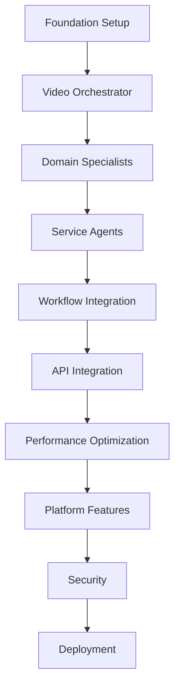

# Video Script & Storyboard Generator - Comprehensive Implementation Plan

## 🎯 Overview
Comprehensive task plan for implementing the Video Script & Storyboard Generator using A2A-MCP framework with TDD approach, real implementations (no mocks), and incremental development.

## 📋 Implementation Phases

### Phase 1: Foundation Setup (Week 1)
#### 1.1 Project Structure & Configuration
- [ ] Create project directory structure for video generator
- [ ] Set up Python virtual environment with uv
- [ ] Install A2A-MCP framework dependencies
- [ ] Configure environment variables for agents
- [ ] Set up logging and observability configuration

#### 1.2 TDD Test Framework Setup
- [ ] Create test directory structure
- [ ] Install pytest and async test dependencies
- [ ] Create conftest.py with real API fixtures
- [ ] Set up test data generators
- [ ] Configure test coverage reporting

#### 1.3 API Gateway Foundation
- [ ] Write failing tests for API gateway endpoints
- [ ] Implement basic FastAPI application
- [ ] Create request/response models with Pydantic
- [ ] Add OpenAPI documentation
- [ ] Implement health check endpoint

### Phase 2: Video Orchestrator Agent (Week 1-2)
#### 2.1 Orchestrator Test Suite
- [ ] Write test_video_orchestrator.py with comprehensive tests
- [ ] Test format detection logic (YouTube, TikTok, Reels)
- [ ] Test workflow planning capabilities
- [ ] Test quality validation thresholds
- [ ] Test parallel execution coordination

#### 2.2 Core Orchestrator Implementation
- [ ] Create VideoOrchestrator class extending StandardizedAgentBase
- [ ] Implement format detection method
- [ ] Implement workflow planning logic
- [ ] Add quality threshold configuration
- [ ] Implement agent coordination methods

#### 2.3 Agent Communication Setup
- [ ] Write tests for A2A protocol communication
- [ ] Implement connection pooling for orchestrator
- [ ] Add message serialization/deserialization
- [ ] Implement timeout and retry logic
- [ ] Create correlation ID tracking

### Phase 3: Domain Specialist Agents (Week 2-3)
#### 3.1 Script Writer Agent
- [ ] Write test_script_writer.py with style tests
- [ ] Test dialogue generation capabilities
- [ ] Test narration writing functions
- [ ] Implement ScriptWriter agent class
- [ ] Add Gemini API integration (real, no mocks)
- [ ] Implement style adaptation logic

#### 3.2 Scene Designer Agent
- [ ] Write test_scene_designer.py
- [ ] Test visual sequence generation
- [ ] Test storyboard creation logic
- [ ] Implement SceneDesigner agent
- [ ] Add visual feasibility validation
- [ ] Create scene transition logic

#### 3.3 Timing Coordinator Agent
- [ ] Write test_timing_coordinator.py
- [ ] Test duration optimization algorithms
- [ ] Test pacing analysis functions
- [ ] Implement TimingCoordinator agent
- [ ] Add platform-specific timing rules
- [ ] Create synchronization logic

#### 3.4 Hook Creator Agent
- [ ] Write test_hook_creator.py
- [ ] Test attention-grabbing generation
- [ ] Test platform-specific hooks
- [ ] Implement HookCreator agent
- [ ] Add engagement scoring
- [ ] Create A/B testing variants

### Phase 4: Service Agents Implementation (Week 3)
#### 4.1 Shot Describer Agent
- [ ] Write test_shot_describer.py
- [ ] Test camera angle descriptions
- [ ] Test technical specifications
- [ ] Implement ShotDescriber agent
- [ ] Add cinematography rules
- [ ] Create shot library integration

#### 4.2 Transition Planner Agent
- [ ] Write test_transition_planner.py
- [ ] Test scene connection logic
- [ ] Test flow optimization
- [ ] Implement TransitionPlanner agent
- [ ] Add transition effects library
- [ ] Create timing synchronization

#### 4.3 CTA Generator Agent
- [ ] Write test_cta_generator.py
- [ ] Test platform-specific CTAs
- [ ] Test conversion optimization
- [ ] Implement CTAGenerator agent
- [ ] Add A/B testing capabilities
- [ ] Create performance tracking

### Phase 5: Workflow Integration (Week 4)
#### 5.1 Parallel Workflow Implementation
- [ ] Write test_parallel_workflow.py
- [ ] Test ParallelWorkflowGraph integration
- [ ] Test execution ordering
- [ ] Implement workflow configurations
- [ ] Add dependency management
- [ ] Create progress tracking

#### 5.2 Quality Validation Pipeline
- [ ] Write test_quality_validation.py
- [ ] Test QualityThresholdFramework integration
- [ ] Test multi-stage validation
- [ ] Implement quality gates
- [ ] Add metric collection
- [ ] Create feedback loops

#### 5.3 Response Formatting
- [ ] Write test_response_formatter.py
- [ ] Test output standardization
- [ ] Test platform-specific formatting
- [ ] Implement ResponseFormatter integration
- [ ] Add export capabilities
- [ ] Create preview generation

### Phase 6: API Integration & Features (Week 4-5)
#### 6.1 REST API Endpoints
- [ ] Write API integration tests
- [ ] Implement POST /api/v1/video/generate
- [ ] Implement GET /api/v1/video/status/{id}
- [ ] Implement GET /api/v1/video/formats
- [ ] Add request validation
- [ ] Create error handling

#### 6.2 WebSocket Support
- [ ] Write WebSocket tests
- [ ] Implement real-time progress updates
- [ ] Add event streaming
- [ ] Create reconnection logic
- [ ] Implement backpressure handling

#### 6.3 Caching Layer
- [ ] Write cache tests
- [ ] Implement Redis integration
- [ ] Add hook template caching
- [ ] Create scene pattern caching
- [ ] Implement cache warming

### Phase 7: Performance Optimization (Week 5)
#### 7.1 Connection Pool Optimization
- [ ] Write performance benchmarks
- [ ] Optimize pool configuration
- [ ] Add health checks
- [ ] Implement cleanup routines
- [ ] Monitor pool metrics

#### 7.2 Parallel Execution Tuning
- [ ] Write load tests
- [ ] Optimize AsyncIO usage
- [ ] Add thread pool for CPU tasks
- [ ] Implement queue distribution
- [ ] Create autoscaling logic

#### 7.3 Monitoring & Metrics
- [ ] Write metric collection tests
- [ ] Integrate Prometheus metrics
- [ ] Add OpenTelemetry tracing
- [ ] Create Grafana dashboards
- [ ] Implement alerting rules

### Phase 8: Platform-Specific Features (Week 6)
#### 8.1 YouTube Optimization
- [ ] Write YouTube-specific tests
- [ ] Implement chapter generation
- [ ] Add keyword optimization
- [ ] Create end screen setup
- [ ] Implement SEO features

#### 8.2 TikTok Optimization
- [ ] Write TikTok-specific tests
- [ ] Implement trending integration
- [ ] Add quick cut generation
- [ ] Create text overlay system
- [ ] Implement loop endings

#### 8.3 Instagram Reels Optimization
- [ ] Write Reels-specific tests
- [ ] Implement visual-first approach
- [ ] Add music synchronization
- [ ] Create hashtag optimization
- [ ] Implement cover selection

### Phase 9: Security & Compliance (Week 6)
#### 9.1 Authentication & Authorization
- [ ] Write security tests
- [ ] Implement JWT authentication
- [ ] Add RBAC authorization
- [ ] Create API key management
- [ ] Implement rate limiting

#### 9.2 Content Moderation
- [ ] Write moderation tests
- [ ] Implement harmful content detection
- [ ] Add injection prevention
- [ ] Create audit logging
- [ ] Implement data retention

#### 9.3 Inter-Agent Security
- [ ] Write mTLS tests
- [ ] Implement certificate management
- [ ] Add message signing
- [ ] Create secret management
- [ ] Implement encryption

### Phase 10: Documentation & Deployment (Week 7)
#### 10.1 Documentation
- [ ] Write API documentation
- [ ] Create developer guide
- [ ] Add architecture diagrams
- [ ] Write deployment guide
- [ ] Create troubleshooting guide

#### 10.2 SDK Development
- [ ] Write SDK tests
- [ ] Create Python SDK
- [ ] Add TypeScript SDK
- [ ] Create CLI tool
- [ ] Write SDK documentation

#### 10.3 Deployment Pipeline
- [ ] Write deployment tests
- [ ] Create Docker containers
- [ ] Set up Kubernetes manifests
- [ ] Implement CI/CD pipeline
- [ ] Add rollback procedures

#### 10.4 Production Readiness
- [ ] Conduct load testing
- [ ] Perform security audit
- [ ] Create runbooks
- [ ] Set up monitoring
- [ ] Plan disaster recovery

## 📊 Task Dependencies

## 🚀 Incremental Development Milestones

### Milestone 1: Basic Generation (Week 2)
- Simple script generation working
- Single format support (YouTube)
- Basic quality validation

### Milestone 2: Multi-Agent Coordination (Week 3)
- All agents communicating
- Parallel execution working
- Quality thresholds enforced

### Milestone 3: Full Platform Support (Week 4)
- All formats supported
- Platform optimizations active
- Real-time progress updates

### Milestone 4: Production Features (Week 5)
- Caching implemented
- Performance optimized
- Security hardened

### Milestone 5: Production Ready (Week 7)
- Full documentation
- SDKs available
- Deployment automated

## 🧪 Testing Strategy

### Test Coverage Targets
- Unit Tests: 90% coverage
- Integration Tests: 80% coverage
- E2E Tests: Critical paths 100%

### Real Implementation Requirements
- NO mock objects for external services
- Real Gemini API calls with test quotas
- Real Redis instance for testing
- Real message queues for integration

### TDD Workflow
1. Write failing test
2. Implement minimal code
3. Make test pass
4. Refactor
5. Repeat

## 📈 Success Metrics

### Performance
- < 2 minutes for all formats
- 60% improvement via pooling
- 99.9% uptime SLA

### Quality
- 85% coherence score
- 80% visual feasibility
- 75% engagement potential

### Scale
- 1000 concurrent generations
- 10,000 requests/hour
- 50ms p99 latency

## 🔄 Continuous Improvement

### Weekly Reviews
- Performance metrics analysis
- Quality score trends
- User feedback integration
- Architecture refinements

### Monthly Updates
- New platform support
- Algorithm improvements
- Feature additions
- Performance optimizations

---

*Implementation Plan created with comprehensive task breakdown*
*Methodology: TDD, Real Implementations, Incremental Development*
*Timeline: 7 weeks to production*
*Generated: 2025-07-15*