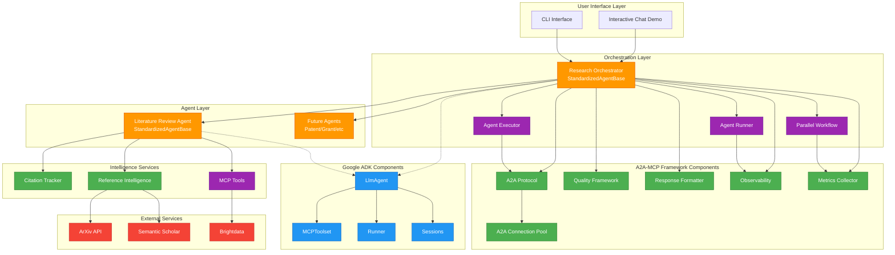

# Framework Component Architecture Diagram

## Research Orchestrator System Component Integration



## Component Communication Flow

### 1. **Request Flow**
```
User → Research Orchestrator → Quality Validation → Agent Executor → Literature Review Agent
```

### 2. **Response Flow**
```
Literature Review Agent → Citation Tracker → Response Formatter → Quality Check → User
```

### 3. **Parallel Execution Flow**
```
Orchestrator → Parallel Workflow → [Multiple Agents] → Result Aggregation → Response
```

### 4. **Intelligence Flow**
```
Reference Intelligence → [ArXiv, Semantic Scholar] → Deduplication → Quality Filter → Results
```

## Key Integration Points

### 1. **StandardizedAgentBase**
- Bridge between A2A-MCP and Google ADK
- Inherits from both frameworks
- Provides unified interface

### 2. **Quality Framework**
- Validates all agent outputs
- Academic domain metrics
- Real-time scoring

### 3. **A2A Protocol**
- Inter-agent communication
- Async message passing
- Connection pooling

### 4. **Observability**
- OpenTelemetry tracing
- Performance metrics
- Error tracking

### 5. **Reference Intelligence**
- Multi-source aggregation
- Parallel searching
- Quality filtering

## Data Flow Examples

### Example 1: Literature Search
```
1. User Query → Research Orchestrator
2. Orchestrator → A2A Protocol → Literature Review Agent
3. Literature Agent → Reference Intelligence → ArXiv API
4. ArXiv Results → Citation Tracker → Quality Validation
5. Validated Results → Response Formatter → User
```

### Example 2: Quality Validation
```
1. Agent Response → Quality Framework
2. Calculate Scores (confidence, evidence, rigor)
3. Compare Against Thresholds
4. Approve/Reject → Add Metadata
5. Return Enhanced Response
```

### Example 3: Parallel Research
```
1. Complex Query → Orchestrator
2. Task Decomposition → Parallel Workflow
3. Concurrent Execution:
   - Literature Review → ArXiv
   - Patent Search → USPTO (future)
   - Grant Search → NSF (future)
4. Result Aggregation → Quality Check
5. Unified Response → User
```